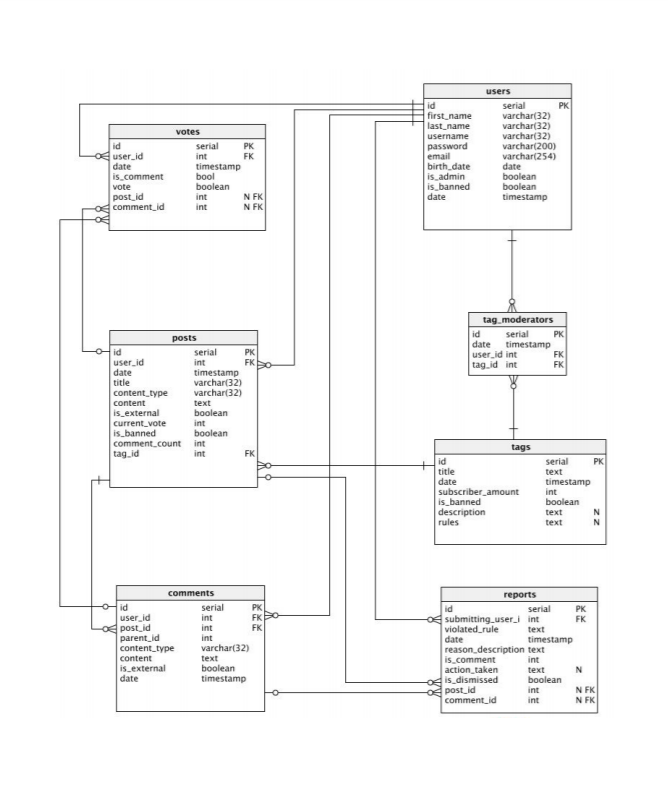

Developer Guide
===============

Database Design
---------------

We have six main tables as Users, Posts, Comments, Tags, Reports, Votes and one extra table Tag_Moderators. 

	E/R Diagram

Accio project constructed around three main folders such as models, routes and templates.
``models`` includes our main six tables and one extra table as classes. Before starting to build these classes we created a ``BaseModel`` that we can get use of for all of our tables.

So, ``models`` are partial representations of a row in table. 
With the ``BaseModel`` they can be easily retrofitted to use their related tables and implement specific functionality for that table. Much of the
database interfacing happens through these ``models``.
``routes`` are functions that dictate what happens, where. They are invoked when a certain route such as /post/<post_id> is accessed. They retrieve the relevant model and template, render it and send to the user.

``templates`` are pages that are filled with content and sent to the user to interact with.

Additionaly, ``static`` folder includes CSS templated for user interface. We used `Bulma CSS framework <https://dansup.github.io/bulma-templates/>`_ for our project.

Code
----

**explain the technical structure of your code**

**to include a code listing, use the following example**::

   .. code-block:: python

      class Foo:

         def __init__(self, x):
            self.x = x

.. toctree::

   member1
   member2
