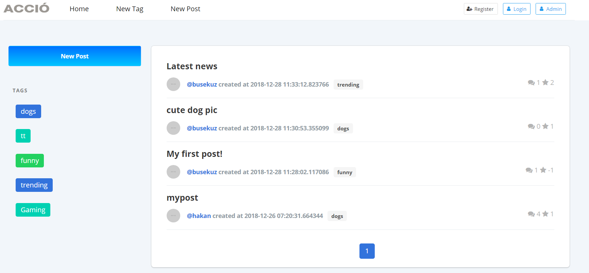

User Guide
==========

**ACCIO, PROVIDES SOCIAL NEWS TO ITS COMMUNITY**

Accio is a link aggregation site, where users can form up communities under tags, and discuss about anything and moderate the content themselves. Main source of information is posts.
Posts can be pretty much anything the user can compose: sites, articles, images, blog posts, ideas that spawn
discussions etc. 
Users can also comment under these posts and contribute to the community even further.

Our project is a social media / user submitted content site. It is intended for communities to discuss
content they create or find on the internet, similar to websites reddit and digg.

Each user has the ability to post content, (images, videos, links, text-posts markdown), comment
on them, and vote posts and comments of other users. Users can select or create tags which are attached to posts for
the type of their context, and later browse the posts with specific tags.

Administrators will have the ability to review reports and users.

Tags are small communities, have posts about specific subjects and have rules created by the
respective tags’ communities. Tagged posts are moderated by Tag Moderators which do not have
site wide permissions but are responsible for moderating their created tags.

Latest posts will be displayed on the home page with their vote and comment counts.

Main page displays a feed with lastest posts and tags!

User can,

	- Access their own profile page
	- Create a new tag
	- Submit a new post
	- View any latest post 
	- Login, logout or register
	- Handle administration if their user type is an admin

	from the homepage.

.. toctree::

   member1
   member2

