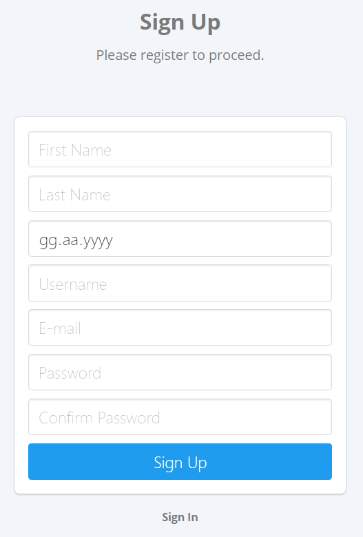
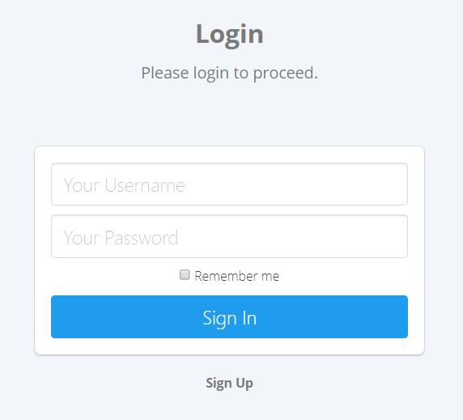
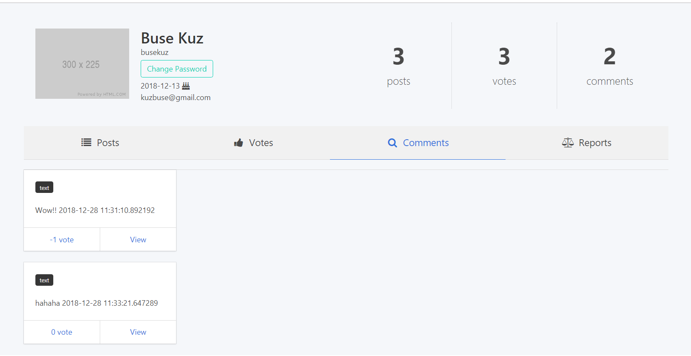
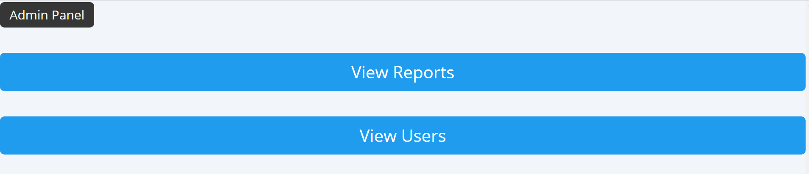
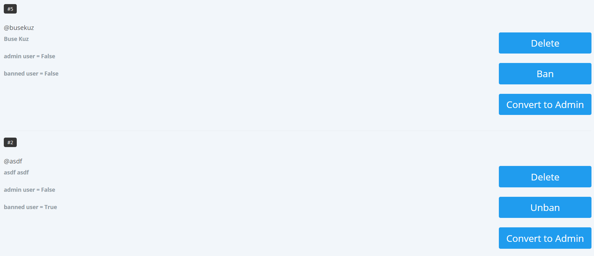
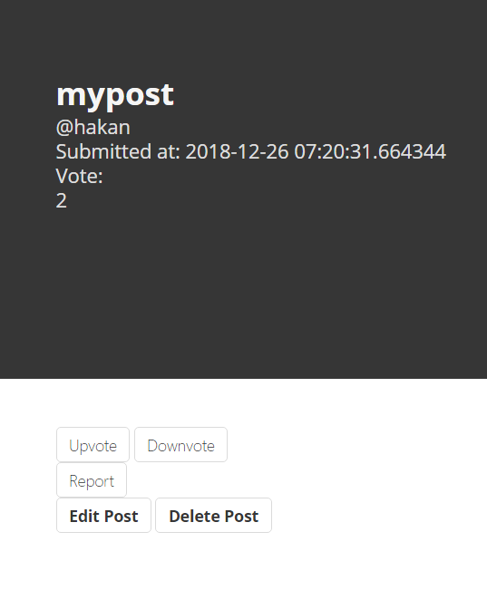
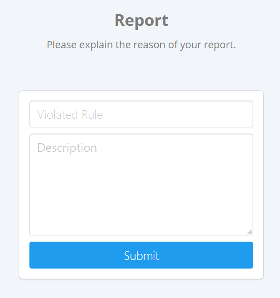
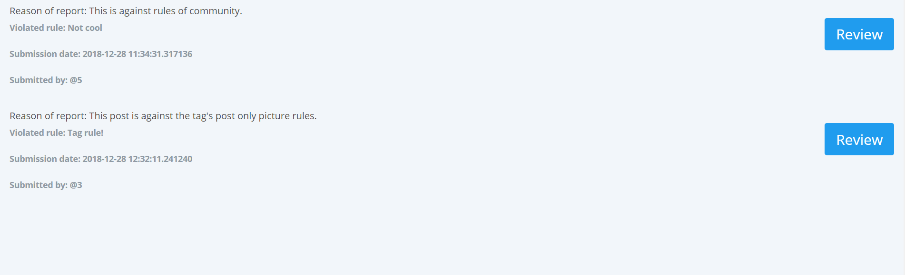
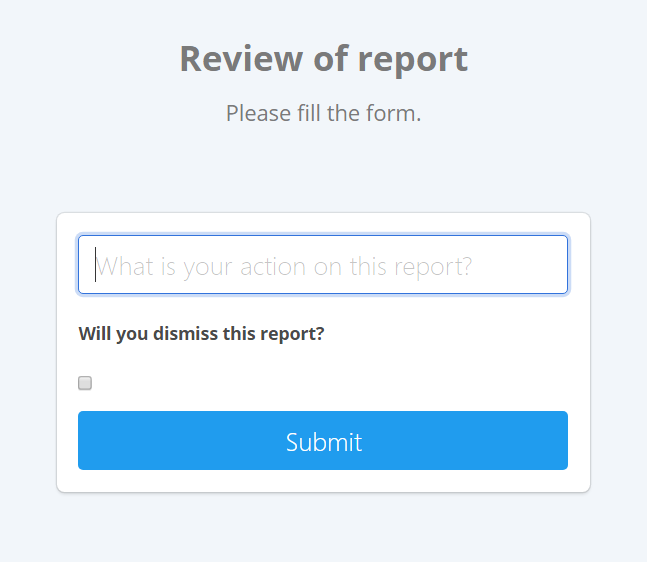

Parts Implemented by Buse Kuz
================================

Users
-----

Users are registered members of Accio community. They can be an admin or a regular user.
Registration is possible with the form below.

	Registration Page

Users have to log in first in order to create tags, create a post, comment, vote or report.

	Login page

Each user has a profile as below, they can view their latest posts, votes, comments and reports. Users can change their password from their profile.
They can check the status of their reports, wheter it is dismissed or not, and delete these reports if they want to.

	User profile

If the user is an admin, there will be a "ban user" button available at each user's profile next to their username. Banned users can not login to the Accio unless an admin unbans that user. Banned users or their posts, comments etc. are not deleted from Accio only the user's access is disabled.

Admins also have access to a panel which they can view users and submitted reports.

	Administration

Admins can make changes on uses from this page. They can ban a user, delete a user permanently or convert them to an admin.

	User actions

Votes
-----

Accio is a content-based website so users can vote these content in order to show what they like or dislike! Users can vote either a post or a comment. Users also can view their latest votes on their profile as we mentioned before.

After a user logged in, he or she can give upvote or a downvote  to a post / comment.

	Voting on a post

A post or a comment can be voted by the same user once. So if a user clicks to upvote or downvote twice that means they taked their vote back. But of course, they can change their vote from upvote to downvote or vice versa.

All posts and commets are displayed with their total points (votes) from users, each upvote gets +1 point while downvotes causes -1 point.

Reports
-------

In case of a user is uncomfortable because of a post or comment, they can report related content.

After they clicked to Report button at the relevant post/comment they are redirected to a form. The reason of their report could be many things such as an inappropriate expression or something against the rules of the tag or user might just think that is not suitable. If so they explain the reason with the form below and the form gets sended to admins.

	Form for a report

At the admin page, admins can view a short summary of reports as a list and they can review the one they choose as we see below.

	List of reports for admins

If they decide to review one, they must decide the action that they will take which means if they are going to ban the owner of the post or there is nothing against rules or any comment they want to make about the situation of the report. If they decide to execute this action they dismiss the report and it will not be shown any more at the admin panel.

	Review form for report

