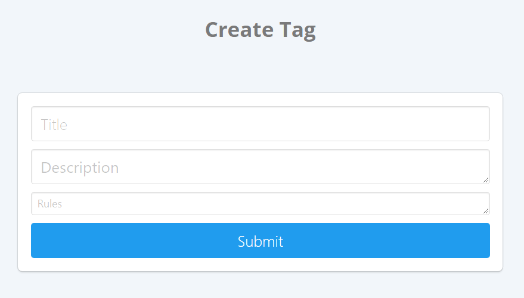
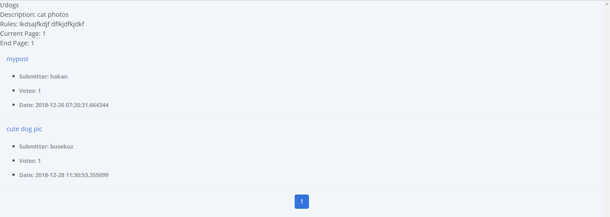
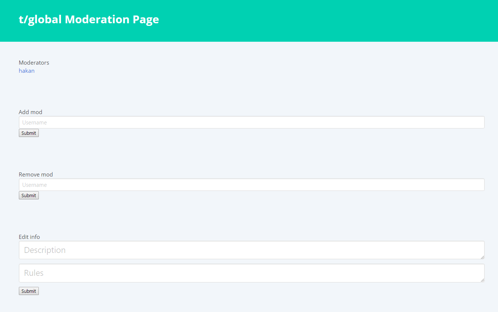
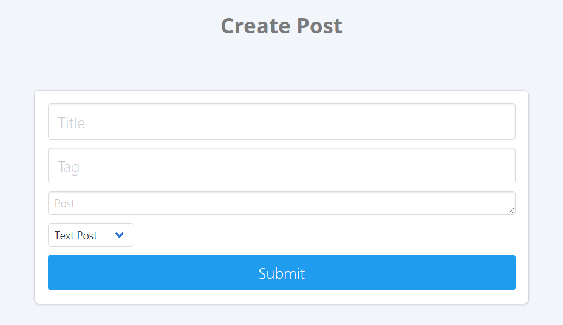
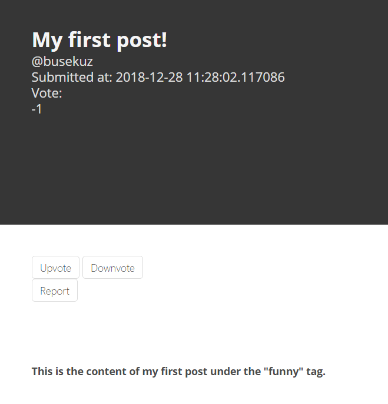
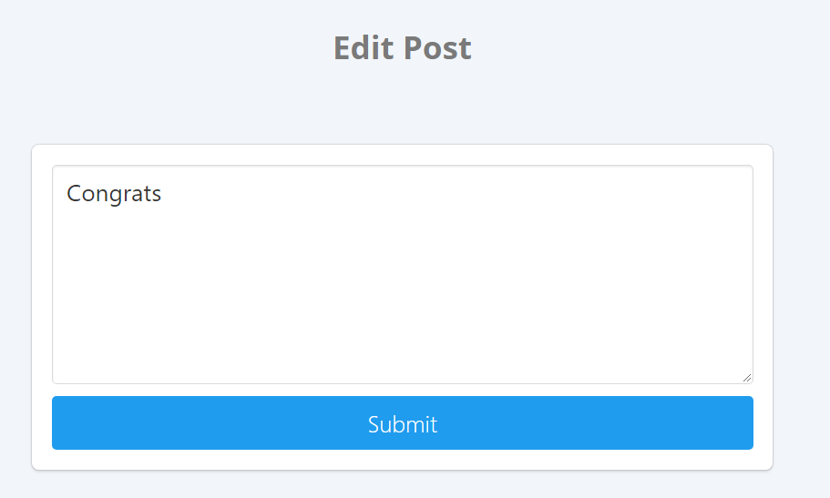

Parts Implemented by Efe Hakan Gençoğlu
================================

Tags
----

Actions:

    - Tag Creation
    - Tag Moderation

Users can create tags through ``/tag_create``.

   Tag Creation

After the tag has been created and filled with posts, the tag
can be viewed from the route ``/t/<tag_title>``

   Tag View

After this, moderators of the tag can access the moderation page at
``/t/<tag_title>/mod``

   Tag Moderation Page

Posts
-----

After a tag has been created, users can submit posts to these tags

Users can submit posts at ``/post/submit``

   Post Creation

After the post is created the user is redirected to the post page
at ``/post/<post_id>``

   Post View

The original submitter of the post or a moderator of the tag can edit
or delete posts

   Post Editing

